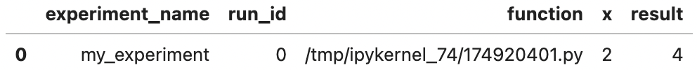

# Quickstart
mintoを活用するための最初のステップをガイドします。このセクションでは、mintoのセットアップから実験データの取り扱いまで、4つの主要なステップを解説します。

- mintoのインストール方法
- 実験データを記録する
- 記録した実験データをテーブルで見る
- 実験データを保存する・読み込む

## mintoのインストール方法
mintoはpipを通じて手軽にインストール可能です。
```sh
pip install minto
```

## 実験データを記録する
mintoを用いて、実験で発生する各種データを簡単に記録することができます。以下の例では、数値の二乗を計算するシンプルな実験を行い、そのデータを記録しています。

```python
import minto

def square(x):
    return x ** 2

x = 2
result = square(x)

experiment = minto.Experiment(name="my_experiment")
with experiment.run():
    experiment.log_solver("function", square)
    experiment.log_parameter("x", x)
    experiment.log_result("result", result)
```

## 記録した実験データをテーブルで見る
mintoは、記録されたデータを整理されたテーブル形式（pandas.DataFrame）で視覚的に確認する機能も提供しています。これにより、実験の概要を瞬時に把握することができます。

```python
experiment.table()
```



## 実験データを保存する・読み込む
実験データをファイルとして保存したり、必要に応じてそのデータを読み込むことも可能です。保存したデータを読み込むには、Experiment生成時に`name`引数に与えた実験名を指定します。

**保存**:

```python
experiment.save()
```

**読み込み**:

```python
experiment = minto.load("my_experiment")
```

保存前と同じテーブルが得られることを確認します。

```python
experiment.table()
```


ここまででmintoの基本的な使用方法を学びました。さらに詳細な機能や設定方法について知りたい場合は、次のセクションや関連ドキュメントを参照してください。