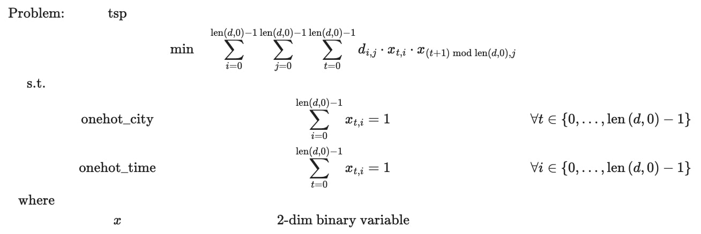
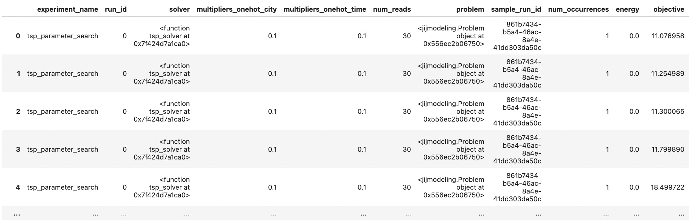
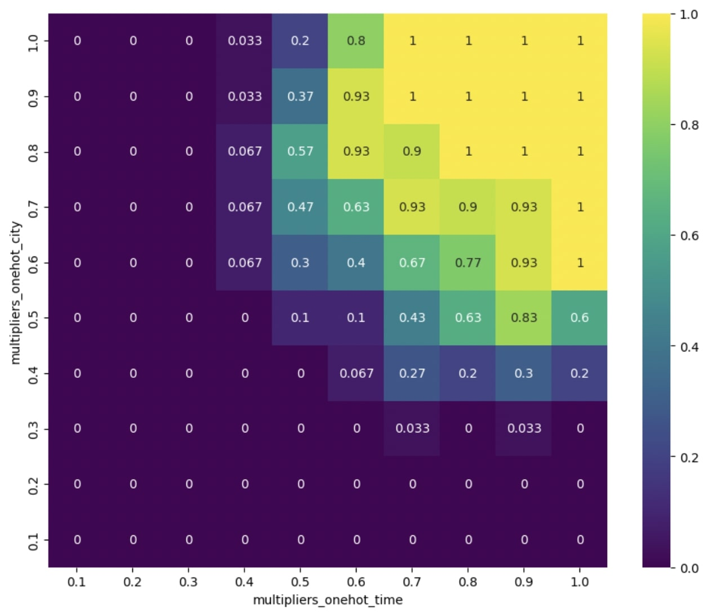
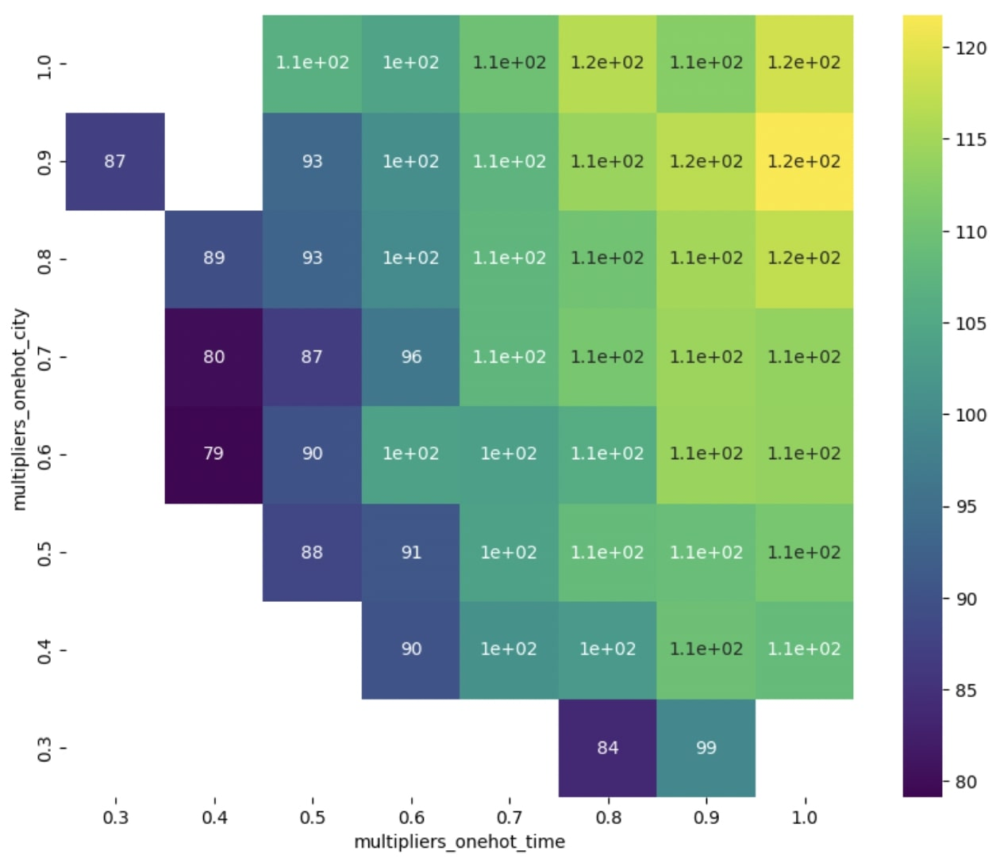
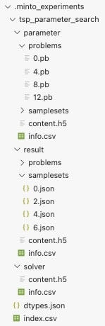

# Tutorial：巡回セールスマン問題に対するQUBOベンチマーク

## 概要

このチュートリアルでは、巡回セールスマン問題(Traveling Salesman Problem, TSP)の最適化を題材に、mintoの実践的な利用方法を学びます。数理最適化では最適解を追求する過程で制約条件の重み(乗数)の調整が不可欠となる場面があります。ここでは乗数に対するグリッドサーチを行い、mintoを活用して効率的に実験管理する方法を紹介します。

数理モデルやソルバーなど、実験を行うために必要なコードを先に示します。この部分はmintoの使い方には直接関連していません。もしコードの詳細な説明が不要な場合は[乗数探索とベンチマーク](#乗数探索とベンチマーク)の章へ進んでください。

```python
import jijmodeling as jm
import jijmodeling_transpiler as jmt
import minto
import numpy as np
import openjij as oj


def load_tsp_instance_data(filename):
    x_pos = []
    y_pos = []
    with open(filename, "r") as f:
        lines = f.readlines()
        node_section_started = False
        for line in lines:
            stripped_line = line.strip()

            if stripped_line == "EOF":
                break

            if node_section_started:
                _, x, y = map(float, stripped_line.split())
                x_pos.append(x)
                y_pos.append(y)

            if stripped_line == "NODE_COORD_SECTION":
                node_section_started = True

    return np.array(x_pos), np.array(y_pos)


def tsp_distance(x_pos, y_pos):
    XX, YY = np.meshgrid(x_pos, y_pos)
    # 各都市間の距離を計算
    distance = np.sqrt((XX - XX.T) ** 2 + (YY - YY.T) ** 2)
    # distance[np.diag_indices_from(distance)] = 9999.0
    return distance


def tsp_problem():
    # 各都市間の距離を表す2次元配列
    d = jm.Placeholder("d", ndim=2)
    # 都市の数
    N = d.shape[0]
    # 2 次元配列で表現されたバイナリ変数成分を持つ n×n 行列
    x = jm.BinaryVar("x", shape=(N, N))
    # インデックスi,jの領域
    i, j = jm.Element("i", belong_to=N), jm.Element("j", belong_to=N)
    # インデックスtの領域
    t = jm.Element("t", N)

    problem = jm.Problem("tsp")
    # 目的関数
    problem += jm.sum([i, j, t], d[i, j] * x[t, i] * x[(t + 1) % N, j])
    # onehot_city制約
    problem += jm.Constraint("onehot_city", jm.sum(i, x[t, i]) == 1, forall=t)
    # onehot_time制約
    problem += jm.Constraint("onehot_time", jm.sum(t, x[t, i]) == 1, forall=i)
    return problem


def tsp_solver(problem, instance_data, multipliers, num_reads):
    compiled_model = jmt.core.compile_model(problem, instance_data)
    pubo_builder = jmt.core.pubo.transpile_to_pubo(compiled_model)
    Q, offset = pubo_builder.get_qubo_dict(multipliers=multipliers)
    sampler = oj.SASampler()
    response = sampler.sample_qubo(Q=Q, num_reads=num_reads)
    result = jmt.core.pubo.decode_from_openjij(response, pubo_builder, compiled_model)
    result.measuring_time = jm.MeasuringTime(
        solve=jm.SolvingTime(solve=response.info["execution_time"] * 1e-6)
    )
    return result
```

### 巡回セールスマン問題（TSP）とは？

TSPは、セールスマンがある都市から出発して各都市を1回ずつ訪問し、再び出発都市に戻るルートの中で最短の移動距離を求める問題です。

### TSPの最適化問題としての定式化

$N$都市を回るセールスマンの移動をモデル化するために、$i\in\{1, \cdots, N\}$を各都市のインデックス、$d_{ij}$を都市$i$と$j$間の距離とします。また、セールスマンの移動を表すためのバイナリ変数$x_{t,i}$を導入します。

$$
x_{t,i} :=
\begin{cases}
    1 & (\text{セールスマンがステップ$t$で都市$i$を訪問}), \\
    0 & (\text{訪問しない}).
\end{cases}
$$

セールスマンがステップ$t$で都市$i$を、次のステップ$t+1$で都市$j$を訪問する場合、その移動距離は$d_{ij}x_{t,i}x_{t+1,j}$となります。

全体の移動距離は次のように計算されます：

$$
\sum_{t=1}^{N}\sum_{i=1}^{N}\sum_{j=1}^{N}d_{ij}x_{t,i}x_{(t+1\mod N),\,j}
$$

ただし、ステップtに関しては$t + N = t$とします。$t+1 mod N$はこれを表しています。  
この全体の移動距離を最小にするのが我々の目的ですが、以下の2つの制約を満たす必要があります。

1. **場所制約**：各都市は1回だけ訪問される。

   $$
   \sum_{t=1}^{N}x_{t,i} = 1 \quad \forall i \in \{1, \dots, N\}
   $$

2. **時間制約**：一度のステップで訪問される都市は1つだけ。

   $$
   \sum_{i=1}^{N}x_{t,i} = 1 \quad \forall t \in \{1, \dots, N\}
   $$

以上の制約の下で全体の移動距離を最小にするバイナリ変数の組み合わせが、TSPの最適解となります。

## Jijのプロダクトによる最適化

Jijの各プロダクトを利用して、先ほど定式化したTSPの数理モデルをQUBO（Quadoratic Unconstraint Binary Optimization）形式に変換し、イジング最適化を実行します。

詳細なプロダクトの情報は、以下のドキュメントをご覧ください：

- [OpenJij](https://openjij.github.io/OpenJij/index.html)
- [JijModeling](https://www.documentation.jijzept.com/docs/jijmodeling/)
- [JijModelingTranspiler](https://www.documentation.jijzept.com/docs/jijmodelingtranspiler/)


### 必要なパッケージのインストール

```bash
pip install minto
pip install jijmodeling-transpiler
pip install matplotlib
pip install seaborn
```

mintoをインストールすると、この後の実験で使用するjijmodelingなどのライブラリも同時にインストールされます。

### JijModelingによる数理モデルの構築
JijModelingは、最適化問題を数式ライクなインターフェイスで直感的に記述するためのモデリングツールです。

TSPの数理モデルの実装例を以下に示します：

```python
import jijmodeling as jm

def tsp_problem():
    # 各都市間の距離を表す2次元配列
    d = jm.Placeholder("d", ndim=2)
    # 都市の数
    N = d.shape[0]
    # 2 次元配列で表現されたバイナリ変数成分を持つ n×n 行列
    x = jm.BinaryVar("x", shape=(N, N))
    # インデックスi,jの領域
    i, j = jm.Element("i", belong_to=N), jm.Element("j", belong_to=N)
    # インデックスtの領域
    t = jm.Element("t", N)

    problem = jm.Problem("tsp")
    # 目的関数
    problem += jm.sum([i, j, t], d[i,j] * x[t, i] * x[(t+1)%N, j])
    # onehot_city制約
    problem += jm.Constraint("onehot_city", jm.sum(i, x[t, i]) == 1, forall=t)
    # onehot_time制約
    problem += jm.Constraint("onehot_time", jm.sum(t, x[t, i]) == 1, forall=i)
    return problem
```

上記で構築したモデルをJupyter Notebookで表示すると、LaTeX形式で確認することができます。

```python
tsp_problem()
```



### インスタンスデータの設定

今回は[TSPLIB](http://comopt.ifi.uni-heidelberg.de/software/TSPLIB95/)からインスタンスデータを取得します。TSPLIBは都市の座標などを含むTSP用のデータセットで、様々な種類のデータが用意されています。ここではulysses16という16都市のデータを使用します。

実際にデータを確認してみましょう。

**ulysses16.tsp**：
```
NAME: ulysses16.tsp
TYPE: TSP
COMMENT: Odyssey of Ulysses (Groetschel/Padberg)
DIMENSION: 16
EDGE_WEIGHT_TYPE: GEO
DISPLAY_DATA_TYPE: COORD_DISPLAY
NODE_COORD_SECTION
 1 38.24 20.42
 2 39.57 26.15
 3 40.56 25.32
 4 36.26 23.12
 5 33.48 10.54
 6 37.56 12.19
 7 38.42 13.11
 8 37.52 20.44
 9 41.23 9.10
 10 41.17 13.05
 11 36.08 -5.21
 12 38.47 15.13
 13 38.15 15.35
 14 37.51 15.17
 15 35.49 14.32
 16 39.36 19.56
 EOF
```
このデータは都市の座標を表しています。以下のコードでは、このデータを読み込みx座標、y座標を抽出する関数と、x座標、y座標から都市間の距離を計算する関数を定義しています。

```python
import numpy as np

def load_tsp_instance_data(filename):
    x_pos = []
    y_pos = []
    with open(filename, 'r') as f:
        lines = f.readlines()
        node_section_started = False
        for line in lines:
            stripped_line = line.strip()

            if stripped_line == "EOF":
                break

            if node_section_started:
                _, x, y = map(float, stripped_line.split())
                x_pos.append(x)
                y_pos.append(y)

            if stripped_line == "NODE_COORD_SECTION":
                node_section_started = True

    return x_pos, y_pos

def tsp_distance(x, y):
    XX, YY = np.meshgrid(x, y)
    # 各都市間の距離を計算
    distance = np.sqrt((XX - XX.T)**2 + (YY - YY.T)**2)
    return distance
```

**ulysses16.opt.tour**：
```
NAME : ulysses16.opt.tour
COMMENT : Optimal solution for ulysses16 (6859)
TYPE : TOUR
DIMENSION : 16
TOUR_SECTION
1 14 13 12 7 6 15 5 11 9 10 16 3 2 4 8
-1
EOF
```
こちらは上記のインスタンスデータに対する最適解の情報になります。`TOUR_SECTION`は最適解の経路を表しています。以下で行うイジング最適化によって得られた結果を評価する際に使用します。

### QUBO定式化によるイジング最適化
次に、TSPの最適化を実施する関数を定義します。最適化には多数の方法が存在しますが、このセクションでは数理モデルをQUBO形式に変換し、その後イジング最適化を適用する手法を採用します。このプロセスには JijModelingTranspiler および OpenJij を使用します。

### QUBOの定式化

最適化を行う関数を定義する前に、QUBOの定式化について紹介します。

TSPのような制約付き最適化問題をイジング最適化解くには、QUBOへの変換が必要です。制約付き問題をQUBOへ変換する際、ペナルティ法を用いて目的関数に制約に関する情報を組み込むのが一般的です。

修正された目的関数は以下の通りです：

$$
H(\{x_{t,i}\}) = \sum_{i=0}^{N-1}\sum_{j=0}^{N-1}\sum_{t=0}^{N-1}d_{i,j}x_{t,i}x_{t+1,j} + \sum_{i=0}^{N-1}A_{i}\left(\sum_{t=0}^{N-1}x_{t,i}-1\right)^{2} + \sum_{t=0}^{N-1}B_{t}\left(\sum_{i=0}^{N-1}x_{t,i}-1\right)^{2}
$$

ここで:
- 第2項は場所制約（onehot_city）に関するペナルティ
- 第3項は時間制約（onehot_time）のペナルティ。
- $A_{i}$と$B_{t}$はペナルティの乗数

この新しい目的関数にイジング最適化を適用することで、制約条件を満たす最適解を見つけることが期待されます。

### JijModelingTranspilerとOpenJijによるイジング最適化

次に、TSPモデルをQUBOに変換し、イジング最適化を行う関数を定義します。このために、JijModelingTranspilerとOpenJijの2つのライブラリを使用します。

### 処理の概要:
1. JijModelingで作成された数理モデル、問題データ、都市の情報、乗数、および計算結果の数を入力として受け取る。
2. JijModelingTranspilerで数理モデルをQUBOに変換する。
3. QUBOをOpenJijで最適化し、結果を得る。
4. 得られた結果をデコードして返す。

```python
import jijmodeling_transpiler as jmt
import openjij as oj

def tsp_solver(problem, instance_data, multipliers, num_reads):
    compiled_model = jmt.core.compile_model(problem, instance_data)
    pubo_builder = jmt.core.pubo.transpile_to_pubo(compiled_model)
    Q, offset = pubo_builder.get_qubo_dict(multipliers=multipliers)
    sampler = oj.SASampler()
    response = sampler.sample_qubo(Q=Q, num_reads=num_reads)
    result = jmt.core.pubo.decode_from_openjij(response, pubo_builder, compiled_model)
    return result
```

### `tsp_solver`の引数に関する詳細説明

- **problem**: JijModelingによって構築されたTSPの数理モデル。
- **instance_data**: 以下の2つのキーと値を持つ辞書。
    - N: 都市の数
    - d: 各都市間の距離
- **multiplier**: キーが制約の名前、対応する値が乗数である辞書。
- **num_reads**: 得られるサンプル（計算結果）の数を表す値。

### `tsp_solver`の使用例:

```python
problem = tsp_problem()
N = 16
x_pos, y_pos = load_tsp_instance_data("ulysses16.tsp")
d = tsp_distance(x_pos, y_pos)
instance_data = {"N":N, "d":d}
multipliers = {"onehot_city":1.0, "onehot_time":1.0}
num_reads = 30

result = tsp_solver(problem, instance_data, multipliers, num_reads)
```

### 結果の評価
最適化問題を解いた結果を評価するときは、その問題を解く背景や目的に応じて適切な評価指標を設定する必要があります。ここでは、TSPの実行可能解を得ることを一番の目的とし、なおかつ、実行可能解の中でできるだけ目的関数値を下げるような解を求めることを目指します。このような場合、以下の2つの指標を用いて結果を評価することができます。

**目的関数値**:  
得られた解の良さを確認するための最も単純な方法です。`tsp_solver`の返り値である`result`には、各サンプルの目的関数値が格納されており簡単に確認できます。

**実行可能解の取得確率**:  
目的関数値を見るときは、その解が実行可能解であるかどうかを同時に確認する必要があります。いくら目的関数値が小さくなっていても制約を大きく違反していれば、その解は意味のないものになってしまいます。目的関数値と同様に実行可能解かどうかも`result`から簡単に確認できます。

今回は目的関数値と実行可能解の取得確率を使って、最適化結果を評価していきます。

### 乗数探索とベンチマーク
**乗数探索の目的**：  
乗数は制約条件の二乗にかけられる定数を指します。この乗数の大きさによって、制約違反時のペナルティの大きさが変わります。したがって、乗数が大きければ大きいほど、制約違反に対するペナルティは増加するため、ソルバーは制約を満たす実行可能解を出しやすくなります。  
一方で、制約条件の乗数調整はTSPの主目的である「総移動距離の最小化」とは無関係です。そのため、単に乗数を大きくするだけでは、実行可能解ではあるが、総移動距離の大きい悪い解が得られてしまいます。より良い解を得るためには制約条件を満たしつつ、総移動距離が小さくなるような丁度いい乗数を発見することが重要となります。例えば、先に示したtsp_solverのサンプルでは、"onehot_time"と"onehot_city"の両方の乗数を1.0としていますが、より適切な乗数の組み合わせを見つけるためにはチューニングが必要です。ここではグリッドサーチによる総当たりの乗数探索を行なっていきましょう。

**ベンチマーク**
```python
import itertools

problem = tsp_problem()

N = 16
x_pos, y_pos = load_tsp_instance_data("ulysses16.tsp")
d = tsp_distance(x_pos, y_pos)
instance_data = {"N":N, "d":d}
opt_value = 74.10873595815309

num_reads = 30
# 乗数の組み合わせを作成
onehot_city_multipliers = [0.1, 0.2, 0.3, 0.4, 0.5, 0.6, 0.7, 0.8, 0.9, 1.0]
onehot_time_multipliers = [0.1, 0.2, 0.3, 0.4, 0.5, 0.6, 0.7, 0.8, 0.9, 1.0]
multipliers_list = [
    {"onehot_city":p0, "onehot_time":p1}
    for p0, p1 in itertools.product(onehot_city_multipliers, onehot_time_multipliers)
]
for multipliers in multipliers_list:
    result = tsp_solver(problem, instance_data, multipliers, num_reads)
```

以上がTSPの制約条件の重みを調整する実験の全容となります。ここから、いよいよmintoを活用した実験管理を行なっていきます。

## mintoを用いた実験管理

上記の実験は、TSPの乗数を調整するためのものですが、次のような、数理最適化の実験でよく行われる基本的なフローを反映しています。

- 問題の定式化 → インスタンスデータの準備 → ソルバーの設定・実装 → ソルバーの実行 → 結果の評価

この実験過程で多くのデータが発生していますが、データの保存など実験管理に関する処理は何も行なっていないため、実験結果をメンバー間で共有したり、後で確認したりすることはできません。今回の実験は比較的単純なものでしたが、実際のプロジェクトや研究で行う実験では、問題やソルバー、パラメータなど、さらに複雑な実験条件となり管理が非常に大変になります。mintoはこのような実験管理にかかるコストを削減し、ユーザーは本来行いたい実験に集中することができます。

### mintoの利点
ここで、mintoを使用することの主な利点を再度確認しておきます。

**1. 一貫性の確保**
mintoを用いればミスなく一貫した形式でのデータ保存が可能になります。

**2. 再現性の向上**
保存されたデータを元に、同じ条件で実験を再現できます。これは、プロジェクトメンバーや研究者間での共同作業時にも有用です。

**3. 自動的な記録**
実験中に生成されたデータを自動的に記録することができます。これにより、予期せぬエラーによるデータの損失を防ぐことができます。

**4. 可視化**
記録したデータをテーブルとして取得する事ができます。これにより、実験結果の可視化が容易になります。

### データの記録
mintoによる実験データの記録方法を確認していきましょう。使い方はとてもシンプルです。上記のベンチマークコードに、少し手を加えるだけで実験データの記録が可能です。


```python

import minto
import itertools

problem = tsp_problem()

N = 16
x_pos, y_pos = load_tsp_instance_data("ulysses16.tsp")
d = tsp_distance(x_pos, y_pos)
instance_data = {"N":N, "d":d}
opt_value = 74.10873595815309

num_reads = 30
# 乗数の組み合わせを作成
onehot_city_multipliers = [0.1, 0.2, 0.3, 0.4, 0.5, 0.6, 0.7, 0.8, 0.9, 1.0]
onehot_time_multipliers = [0.1, 0.2, 0.3, 0.4, 0.5, 0.6, 0.7, 0.8, 0.9, 1.0]
multipliers_list = [
    {"onehot_city":p0, "onehot_time":p1}
    for p0, p1 in itertools.product(onehot_city_multipliers, onehot_time_multipliers)
]

experiment = minto.Experiment(name="tsp_parameter_search")

for multipliers in multipliers_list:
    # runメソッドによって実験の開始を宣言し、同一のコンテキストで行われる実験を管理します。
    # 同一コンテキスト内で記録されたデータは同じidに紐づきます。
    with experiment.run():
        # ソルバーの記録
        experiment.log_solver("solver", tsp_solver)

        # パラメータの記録
        experiment.log_parameter("problem", problem)
        for k, v in multipliers.items():
            experiment.log_parameter(f"multipliers_{k}", v)
        experiment.log_parameter("num_reads", num_reads)


        result = tsp_solver(problem, instance_data, multipliers, num_reads)
        # ソルバーの返り値を記録
        experiment.log_result("result", result)

# 実験結果の保存
experiment.save()
```

これで、実験データを記録することができました。

### 記録したデータの可視化

記録したデータは、`table`メソッドによってpandas.DataFrameとして取得できます。

```python
df = experiment.table()
```



DataFrameのインデックスは`run`メソッドを呼んだ回数だけ発行され、カラムには`log`系のメソッドの`name`引数に与える値が入ります。ここで、"objective"や”onehot_city_total_violation"など記録した覚えのないカラムも含まれています。これは、mintoの特徴の一つで、`log_result`によって記録したデータがjijmodeling.SampleSet型である場合、SampleSetの内部構造を解析し、ユーザーが読みやすいようにテーブルに自動で展開する機能によるものです。この機能により、SampleSet型のデータを扱う際に、より直感的にデータを確認することができます。

それでは、このDataFrameを使って、実行可能解の目的関数値と実行可能解の取得確率をヒートマップで可視化してみましょう。

**実行可能解の取得確率のヒートマップ**：
```python
import matplotlib.pyplot as plt
import seaborn as sns

heatmap_data = df.pivot_table(
    index="multipliers_onehot_city",
    columns="multipliers_onehot_time",
    values="is_feasible",
    aggfunc="mean",
    dropna=False,
).astype("float")

# ヒートマップの作成
plt.figure(figsize=(10, 8))
sns.heatmap(heatmap_data.iloc[::-1], cmap="viridis", annot=True)

# グラフの表示
plt.show()
```

**目的関数のヒートマップ**：
```python

# 実行可能解のみを取得
feas_data = df[df.filter(regex="violation").sum(axis=1) == 0]
heatmap_data = feas_data.pivot_table(
    index="multipliers_onehot_city",
    columns="multipliers_onehot_time",
    values="objective",
    aggfunc="mean",
    dropna=False,
).astype("float")

# ヒートマップの作成
plt.figure(figsize=(10, 8))
sns.heatmap(heatmap_data.iloc[::-1], cmap="viridis", annot=True)

# グラフの表示
plt.show()
```



この結果を見ると、multipliers_onehot_city=0.5, multipliers_onehot_time=0.5の付近から実行可能解が出始めていることがわかります。実行可能解の目的関数値がどうなっているのかも確認してましょう。



multipliers_onehot_city=0.6, multipliers_onehot_time=0.4のとき目的関数値が最も良くなっています。また、白い領域は実行可能解が存在しないために、目的関数値が計算できなかったことを表しています。`opt_value`は74.10873595815309なので、この値付近までは下がっていませんが、実行可能解の中でできるだけ目的関数値を小さくするような、大まかな乗数の値を見つけることができました。さらに目的関数値を小さくする解を見つけるには、より細かなパラメータ調整や、ソルバーの実装に工夫が必要になりますが、mintoのチュートリアルの主旨からは外れるため、これ以上踏み込んだ実験は行いません。

ここで注目すべきは、実験データが整理されているため、実行可能解のヒートマップと目的関数のヒートマップをほぼ同じ方法で作成できていることです。このように、mintoを活用することで、可視化や分析用のコードを書く際の負担を軽減することができます。また、実験データはpandas.DataFrameとして取得できるため、pandasの便利な機能を駆使した、より込み入った分析も可能になります。

### 保存した実験データの確認
保存した実験データはExperimentインスタンス生成時に`savedir`引数で指定したパスに保存されます。デフォルトでは`./.minto_experiments`以下に保存されるようになっています。

ここで、どのような構造で実験データが保存されているか確認してみましょう。



`savedir`下にExperimentに与えた`name`引数の値でディレクトリが作成され、その下に **parameter**, **result**, **solver** というディレクトリが作成されます。各ディレクトリには、対応する`log`系のメソッドで記録したデータが保存されます。例えば、`log_parameter`で格納したデータは **parameter** ディレクトリに保存されます。これら3つのディレクトリ下には、さらに **problems**, **samplesets** というディレクトリが作成されています。これは、jijmodeling.Problem型、jijmodeling.SampleSet型のデータを個別に保存するためのディレクトリです。その他のデータは **content.h5** というHDFファイルにまとめて保存されます。

データを読み込み時は、`load`メソッドを使用します。この時、Experimentに与えた名前を指定ください。今回の場合は`tsp_parameter_search`です。

```python
experiment = minto.load("tsp_parameter_search")

#同じテーブルが保存されているか確認
experiment.table()
```


## まとめ
以上で、mintoを用いた実験管理のチュートリアルは終了です。mintoを使うことで、実験データの記録や可視化を簡単に行うことができます。また、実験データの保存により、実験の再現性を高めることができます。今回は、TSPの乗数を調整する実験を例にmintoの使い方を紹介しましたが、実際のプロジェクトや研究など実験管理が必要なあらゆる場面で活用することができます。ぜひmintoを使って実験管理を行なってみてください。